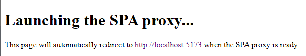

# Initializing this repository

Here is the description of how the projects in this repository were brought up to a minimally
functional state. This state means the projects can be built and run, and when servers are run,
they produce *some* reasonable output. The server and client, however, do not share any common
functionality, there are no APIs between them, and they can't really be considered to be a single
application.

## Initializing web client project

We will use Yarn as our package manager and use
[create-vite](https://vite.dev/guide/#scaffolding-your-first-vite-project) package to set up our
client project. Vite gives us an excellent dev server with dynamic updates, configurable proxy
to backend server and much more. The template we're using sets up a React app written in Typescript.

```
$ yarn create vite web-client -- --template react-ts
yarn create v1.22.4
warning From Yarn 1.0 onwards, scripts don't require "--" for options to be forwarded. In a future version, any explicit "--" will be forwarded as-is to the scripts.
[1/4] Resolving packages...
[2/4] Fetching packages...
[3/4] Linking dependencies...
[4/4] Building fresh packages...

success Installed "create-vite@5.5.5" with binaries:
      - create-vite
      - cva
[##] 2/2
Scaffolding project in C:\Users\niko\github\web-grpc\web-client...

Done. Now run:

  cd web-client
  yarn
  yarn dev

Done in 0.34s.
```

### Update Yarn to latest stable

In the initialization we were using whatever version of Yarn was installed system-wide on the dev
machine, in our case Yarn 1.22.4. This is normal, Yarn version 2 and above are not intended to be
installed system-wide. Instead, these new versions are installed per-project. The old version is,
however, fine for bootstrapping a project and setting the pre-project version.

The latest stable release is codenamed `berry` so let's update to that. As of writing, this gets us
version 4.5.3 but this can change. 

```
$ cd web-client/

$ yarn set version berry
Resolving berry to a url...
Downloading https://github.com/yarnpkg/berry/raw/master/packages/berry-cli/bin/berry.js...
Saving it into C:\Users\niko\github\web-grpc\web-client\.yarn\releases\yarn-berry.js...
Updating C:\Users\niko\github\web-grpc\web-client/.yarnrc.yml...
Done!
```

If you wish to be more specific, say restrict the installed version to Yarn 4, you can do
`yarn set version 4.x` *after* setting the version to `berry`. The 1.x versions of Yarn do not
understand most possible tags documented for
[yarn set version](https://yarnpkg.com/cli/set/version).

### Fix 'Dynamic require of "util" is not supported'

Now we can attempt to install the dependencies for our project, but there's a conflict: our project
is declared as ES module by default (`package.json` contains declaration `"type": "module"`), but
the Yarn package is a CommonJS module. This results in an error:

```
$ yarn
...
Error: Dynamic require of "util" is not supported
    at file:///C:/Users/niko/github/web-grpc/web-client/.yarn/releases/yarn-berry.js:4:394
    at file:///C:/Users/niko/github/web-grpc/web-client/.yarn/releases/yarn-berry.js:4:3568
    at file:///C:/Users/niko/github/web-grpc/web-client/.yarn/releases/yarn-berry.js:4:474
    at file:///C:/Users/niko/github/web-grpc/web-client/.yarn/releases/yarn-berry.js:9:46349
    at file:///C:/Users/niko/github/web-grpc/web-client/.yarn/releases/yarn-berry.js:4:474
    at file:///C:/Users/niko/github/web-grpc/web-client/.yarn/releases/yarn-berry.js:401:1509
    at file:///C:/Users/niko/github/web-grpc/web-client/.yarn/releases/yarn-berry.js:745:448
    at ModuleJob.run (node:internal/modules/esm/module_job:268:25)
    at async onImport.tracePromise.__proto__ (node:internal/modules/esm/loader:543:26)
    at async asyncRunEntryPointWithESMLoader (node:internal/modules/run_main:116:5)

Node.js v22.11.0
```

To fix this, we can create a new `package.json` in `.yarn/releases`, declaring that directory as
containing CommonJS code.

```json
{
    "type": "commonjs"
}
```

### Install dependencies and run dev server

Now we should be able to install our dependencies.

```
$ yarn
➤ YN0000: · Yarn 4.5.3
➤ YN0000: ┌ Resolution step
➤ YN0085: │ + @eslint/js@npm:9.15.0, @types/react-dom@npm:18.3.1, @types/react@npm:18.3.12, @vitejs/plugin-react@npm:4.3.3, eslint-plugin-react-hooks@npm:5.0.0, eslint-plugin-react-refresh@npm:0.4.14, eslint@npm:9.15.0, globals@npm:15.12.0, and 290 more.
➤ YN0000: └ Completed in 4s 618ms
➤ YN0000: ┌ Fetch step
➤ YN0013: │ 94 packages were added to the project (+ 89.9 MiB).
➤ YN0000: └ Completed in 1s 988ms
➤ YN0000: ┌ Link step
➤ YN0000: │ ESM support for PnP uses the experimental loader API and is therefore experimental
➤ YN0007: │ esbuild@npm:0.21.5 must be built because it never has been before or the last one failed
➤ YN0000: └ Completed in 0s 904ms
➤ YN0000: · Done with warnings in 7s 549ms
```

Yarn has created several files for us, and not all of them should be commited to Git repository.
Following the
[official .gitignore guide](https://yarnpkg.com/getting-started/qa#which-files-should-be-gitignored)
we can add the non-Zero-Installs version to `/we-client/.gitignore`. The Zero-Installs is a great
feature, but I've not used that here to limit the scope of this tutorial.

Now we should be able to start the client project.

```
$ yarn dev

  VITE v5.4.11  ready in 1091 ms

  ➜  Local:   http://localhost:5173/
  ➜  Network: use --host to expose
  ➜  press h + enter to show help
```

Opening that URL should show a landing page of the Vite + React + Typescript template we used.


### Support for IDEs

Yarn with PnP needs some special configuration for IDEs so that they find the dependency packages
and can provide automatic completion etc. for them. For details, see
[Editor SDKs](https://yarnpkg.com/getting-started/editor-sdks) page on Yarn website.

I will go through the setup for VSCode. First we'll use the `@yarnpkg/sdks` tool:

```
$ cd web-client
$ yarn dlx @yarnpkg/sdks vscode
...
➤ YN0000: ┌ Generating SDKs inside .yarn/sdks
➤ YN0000: │ ✓ Eslint
➤ YN0000: │ ✓ Typescript
➤ YN0000: │ • 6 SDKs were skipped based on your root dependencies
➤ YN0000: └ Completed
➤ YN0000: ┌ Generating settings
➤ YN0000: │ ✓ Vscode (new ✨)
➤ YN0000: └ Completed
```

This generates a `.vscode` directory inside the `client-web` directory. We'll need to move its
contents to a top level `.vscode` directory in the project. If this wasn't a freshly created
project, we might need to merge the file contents with any already existing files in the top-level
`.vscode` directory. After this move the paths inside `settings.json` will not be correct any
longer so they need to be updated.

```json
"eslint.nodePath": "web-client/.yarn/sdks",
"typescript.tsdk": "web-client/.yarn/sdks/typescript/lib",
```

Here, I added `web-client/` to both paths to get them pointing to existing directories.

Finally, we can select in VSCode that we want to use the workspace version of Typescript. Even if
it's the same version number as provided by VSCode itself, the workspace version contains extra
functionality so that it can use PnP to locate any packages.

## Create the .NET server project

We will use `dotnet` commands at the repository root to bring up a .NET server project. The `react`
template creates a server that is readily connectable to the Vite development server on development
time, and serves the compiled app in production.

```
$ dotnet new sln
The template "Solution File" was created successfully.

$ dotnet new react -o Server
The template "ASP.NET Core with React.js" was created successfully.

Processing post-creation actions...
Restoring C:\Users\niko\github\web-grpc\Server\Server.csproj:
  Determining projects to restore...
  Restored C:\Users\niko\github\web-grpc\Server\Server.csproj (in 179 ms).
Restore succeeded.

$ dotnet sln add Server/
Project `Server\Server.csproj` added to the solution.
```

### Connect the .NET server and the client

We will need to update `/Server/Server.csproj` to set the correct location, development server URL
and launch command for the client. Additionally, we will update to a more recent .NET framework
(from 7 to 8).

```xml
<TargetFramework>net8.0</TargetFramework>
<SpaRoot>..\web-client\</SpaRoot>
<SpaProxyServerUrl>http://localhost:5173</SpaProxyServerUrl>
<SpaProxyLaunchCommand>yarn dev</SpaProxyLaunchCommand>
```

Then we'll need to change any `npm` invocations to use `yarn` instead. Note that there are two instances of the `install` command.

```xml
<Exec WorkingDirectory="$(SpaRoot)" Command="yarn install" />
<Exec WorkingDirectory="$(SpaRoot)" Command="yarn run build" />
```

Also we have to change the line that checks for `node_modules` directory to search for
the `.pnp.cjs` file instead.

```xml
<Target Name="DebugEnsureNodeEnv" BeforeTargets="Build" Condition=" '$(Configuration)' == 'Debug' And !Exists('$(SpaRoot).pnp.cjs') ">
```

Still one more: our production build creates `dist` directory instead of `build`, so we need to 
change that as well.

```xml
<DistFiles Include="$(SpaRoot)dist\**" />
```


Finally we can remove the directory `/Server/ClientApp` -- we won't be using that. It contains the
default client of the `react` template, but tweaking that template is more trouble than it's worth.

Now we should be able to start the development server.

```
$ cd Server
$ dotnet run
warn: Microsoft.AspNetCore.StaticFiles.StaticFileMiddleware[16]
      The WebRootPath was not found: C:\Users\niko\github\web-grpc\Server\wwwroot. Static files may be unavailable.
warn: Microsoft.AspNetCore.StaticFiles.StaticFileMiddleware[16]
      The WebRootPath was not found: C:\Users\niko\github\web-grpc\Server\wwwroot. Static files may be unavailable.
warn: Microsoft.AspNetCore.Server.Kestrel.Core.KestrelServer[8]
      The ASP.NET Core developer certificate is not trusted. For information about trusting the ASP.NET Core developer certificate, see https://aka.ms/aspnet/https-trust-dev-cert.
info: Microsoft.Hosting.Lifetime[14]
      Now listening on: https://localhost:7101
info: Microsoft.Hosting.Lifetime[14]
      Now listening on: http://localhost:5073
info: Microsoft.Hosting.Lifetime[0]
      Application started. Press Ctrl+C to shut down.
```

At this point, we can visit http://localhost:5073 and we should be greeted with a simple page that
tells it's starting the SPA proxy -- the Vite development server we tried out at the end of setting
up the client.



After a few moments this should redirect to the same Vite + React page we saw when setting up the
client.

## Troubleshooting

If `dotnet run` fails to start the Vite development server, check that you can still run `yarn dev`
in the `/web-client` directory. This can produce better error reports.

It's possible to accidentally mess up the installation in `/web-client` -- for example, by having
some remaining references to `npm install` in the `/server/Server.csproj` file. First things to
check in case of such errors:

* Does file `/web-client/package-lock.json` exist? Remove it. Only `npm` creates this file, `yarn`
  does not. If it exists, `yarn` errors out as a safety measure.
* Does `/web-client/node_modules` contain more directories than `.vite`? If there's lot of stuff,
  remove the whole `node_modules` directory. Yarn should not install packages there, but only
  in its own cache directories.
* Does `/web-client/.yarnrc.yml` contain `nodeLinker: node-modules`? Remove that line, or change it
  to `nodeLinker: pnp`. Using `npm` or old versions of Yarn on the project can trigger the fallback
  to using `node_modules` directory, but it should not happen for new projects.

## Publishing

We can also build a package that contains the .NET server and the React client.

```
$ dotnet publish Server/Server.csproj -o publish/ --self-contained
  Determining projects to restore...
  Restored C:\Users\niko\github\web-grpc\Server\Server.csproj (in 8,85 sec).
  Server -> C:\Users\niko\github\web-grpc\Server\bin\Release\net8.0\win-x64\Server.dll
  Ô×ñ YN0000: ┬À Yarn 4.5.3
  Ô×ñ YN0000: Ôöî Resolution step
  Ô×ñ YN0000: Ôöö Completed
  Ô×ñ YN0000: Ôöî Fetch step
  Ô×ñ YN0000: Ôöö Completed
  Ô×ñ YN0000: Ôöî Link step
  Ô×ñ YN0000: Ôöé ESM support for PnP uses the experimental loader API and is therefore experimental
  Ô×ñ YN0000: Ôöö Completed
  Ô×ñ YN0000: ┬À Done with warnings in 0s 265ms
  vite v5.4.11 building for production...
  transforming...
  Ô£ô 34 modules transformed.
  rendering chunks...
  computing gzip size...
  dist/index.html                   0.46 kB Ôöé gzip:  0.30 kB
  dist/assets/react-CHdo91hT.svg    4.13 kB Ôöé gzip:  2.05 kB
  dist/assets/index-n_ryQ3BS.css    1.39 kB Ôöé gzip:  0.71 kB
  dist/assets/index-Dxp5zAIY.js   143.20 kB Ôöé gzip: 46.06 kB
  Ô£ô built in 553ms
  Server -> C:\Users\niko\github\web-grpc\publish\
```

Now, the directory `/publish` contains all the files required for our server and client to be run
on your current computer. If you wish to change that, you can add `-r` flag to the publish command.
For example, `-r linux-musl-x64` gives you package that can be run on Alpine Linux on 64-bit x86,
or `-r linux-musl-arm64` gives same but for 64-bit ARM processors.

We can now try out the production server on the local computer.

```
$ cd publish/
$ DOTNET_URLS='http://localhost:5000;https://localhost:5001' ./Server
warn: Microsoft.AspNetCore.Server.Kestrel.Core.KestrelServer[8]
      The ASP.NET Core developer certificate is not trusted. For information about trusting the ASP.NET Core developer certificate, see https://aka.ms/aspnet/https-trust-dev-cert.
info: Microsoft.Hosting.Lifetime[14]
      Now listening on: http://localhost:5000
info: Microsoft.Hosting.Lifetime[14]
      Now listening on: https://localhost:5001
info: Microsoft.Hosting.Lifetime[0]
      Application started. Press Ctrl+C to shut down.
info: Microsoft.Hosting.Lifetime[0]
      Hosting environment: Production
info: Microsoft.Hosting.Lifetime[0]
      Content root path: C:\Users\niko\github\web-grpc\publish
```

We need to specify a `https` URL in `DOTNET_URLS` since the server attempts to redirect all `http`
requests to `https` but there's no `https` URL configured by default. Alternatively we could remove
the `app.UseHttpsRedirection();` command from `/Server/Program.cs` to allow plain `http` without
encryption.
